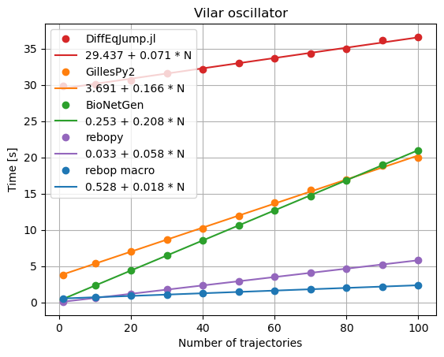

# Vilar oscillator benchmark

We simulated the Vilar oscillator model with several programs.

## rebop (Rust)

`hyperfine 'touch vilar.rs && cargo run --release --bin vilar'`

## GillesPy2 (C++ & Python)

`time python3 vilar.py`

## BioNetGen (C++ & Perl)

`time BNG2.pl vilar.bngl`

## DiffEqJump.jl (Julia)

`time julia vilar.jl`

