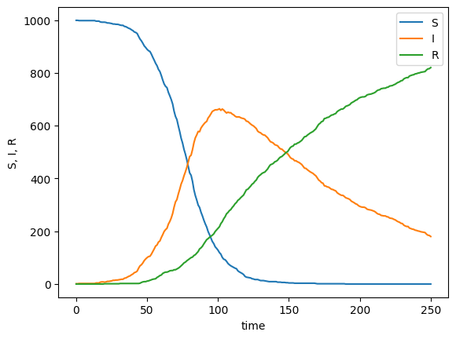
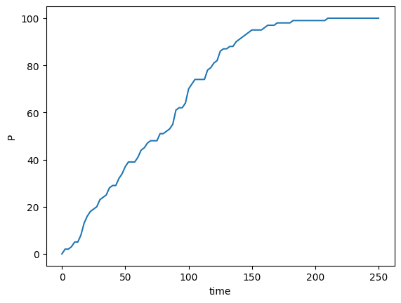

# rebop

`rebop` is a fast stochastic simulator for well-mixed chemical reaction networks.

It is written in [Rust](https://www.rust-lang.org/), a modern, safe, and fast
language. But it is available as any Python package, through PyPI, so it can
be easily installed with `pip install rebop`.

Stochastic models can then be implemented with a simple API, for example for the
classic [SIR model](https://en.wikipedia.org/wiki/SIR_model):

```python
import rebop

sir = rebob.Gillespie()
# A susceptible individual can be infected by an infected one
#     S + I → I + I     at rate 1e-4
sir.add_reaction(1e-4, ["S", "I"], ["I", "I"])
# An infected individual can recover and become resistant
#         I → R         at rate 0.01
sir.add_reaction(0.01, ["I"], ["R"])

# Run the simulation
ds = sir.run({"S": 999, "I": 1}, tmax=250, nb_steps=250)
```

The output is an
[`xr.Dataset`](https://docs.xarray.dev/en/stable/generated/xarray.Dataset.html#xarray.Dataset)
object which can be plotted:



It can also be used to model more complex systems, with non [law of mass
action](https://en.wikipedia.org/wiki/Law_of_mass_action) rates:

```python
import rebop

mm = rebop.Gillespie()
# Enzymatic reaction with a Michaelis-Menten rate
#         A → P         at rate V * A / (Km + A)
mm.add_reaction("V * A / (Km + A)", ["A"], ["P"])

params = {"V": 1, "Km": 20}

ds = mm.run({"A": 100}, tmax=250, nb_steps=100, params=params)
```


